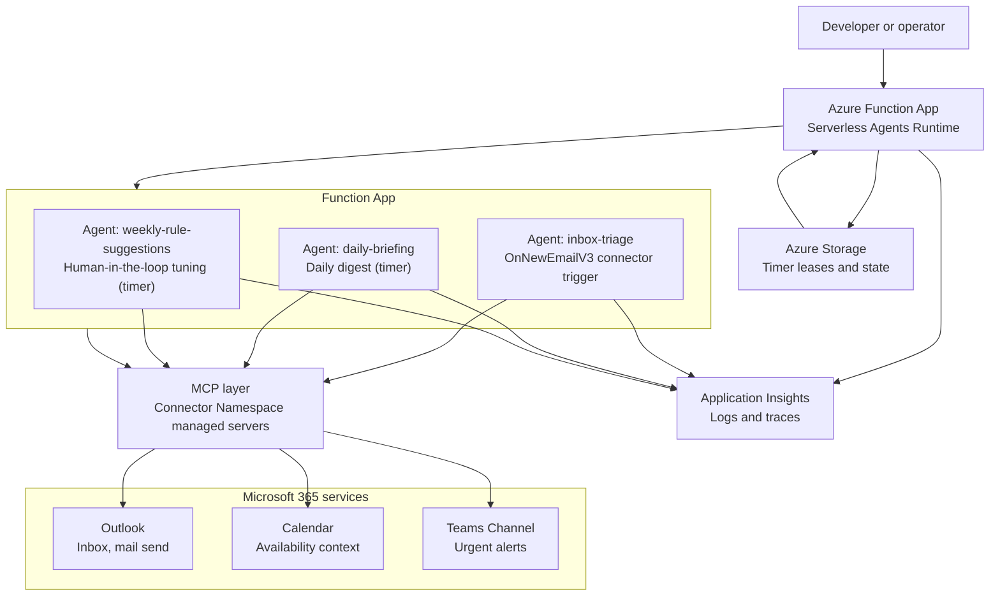

# M365 Inbox Agent for Azure Functions (Python) [](https://www.python.org/downloads/) [](https://github.com/codespaces/new?repo=Azure-Samples%2Fm365-inbox-agent-functions-python) [](https://portal.azure.com/#create/Microsoft.Template/uri/<TODO-integrator-fill>)

**Think of it as [🦞 OpenClaw](https://github.com/openclaw/openclaw) for the business: a skills-driven agent that actually does things, but secured by Azure managed identity, Entra-authorized M365 connectors, and your own auditable Python functions.**

An inbox-triage sample for the Azure Functions Serverless Agents Runtime (preview). Three agents read a Microsoft 365 inbox, decide what matters, send replies, post urgent alerts to Teams, and suggest rule changes for a human to approve.

You can run all three agents fully locally. Use `uv run func start` against your real Outlook + Teams via the MCP connectors, or run offline against `sample-data/inbox/*.json` after a one-time `azd provision` (creates the Foundry model deployment the agents need). The one capability that only works deployed is the OnNewEmailV3 event trigger that fires `inbox-triage` automatically on new mail; locally you fire it manually from `chat.py`.

> 📝 Prefer pure markdown with no custom Python? See the [markdown-only sibling](https://github.com/Azure-Samples/m365-inbox-agent-functions-markdown). Full comparison at [the bottom](#-python-variant-vs-markdown-variant).

##  Prerequisites

- Python 3.13+. Easiest install: [uv](https://docs.astral.sh/uv/). Then `uv python install 3.13`.
- [Azure Functions Core Tools v4](https://learn.microsoft.com/en-us/azure/azure-functions/functions-run-local) ≥ 4.12.0 (v5 preview is not yet compatible)
- [Azure Developer CLI (`azd`)](https://learn.microsoft.com/en-us/azure/developer/azure-developer-cli/)
- For live M365 or deploy: an Azure subscription, a Microsoft Foundry project/model deployment, and permission to authorize Microsoft 365 connectors
- The `connector-namespace` Azure CLI extension (needed for live M365 or `azd up`):

  ```bash
  curl -fsSL https://aka.ms/connector-namespace-cli-install | sh
  ```

  PowerShell + offline install: [Connectors quickstart](https://sandboxes.azure.com/docs/sandboxes/connectors).

##  Make it yours (private copy)

Once you start editing rules, sample inbox data, or running against your real M365 tenant, you'll want a private copy. Public forks cannot be made private on GitHub. Use this repo as a template instead: click <kbd>Use this template</kbd> at the top of GitHub and choose Private, or with [GitHub CLI](https://cli.github.com/):

```bash
OWNER=$(gh api user --jq .login)   # or override with your org
REPO=my-inbox-agent                # or override with any name

gh repo create "$OWNER/$REPO" \
  --template Azure-Samples/m365-inbox-agent-functions-python \
  --private --clone
```

This creates an independent repo with no fork relationship, so accidental PRs back to `Azure-Samples` are not possible.

Files most likely to contain personal/tenant information:

- `skills/vip-rules.md`, `skills/triage-rules.md`: your VIPs and triage logic
- `sample-data/inbox/*.json`: any real mail you paste in for testing
- `local.settings.json`, `.env`: secrets and endpoints (already gitignored)
- `infra/main.parameters.json`: subscription/tenant-specific values if you customize

Even in a private repo, never commit real secrets. This sample uses managed identity for Foundry and Entra-authorized connectors for Microsoft 365, so there are no app-managed credentials to leak. For any custom integrations you add, keep that pattern (managed identity, then role assignment) rather than pasting keys.

**Getting upstream updates.** Sync your private copy from this repo with a single GitHub CLI command, then pull locally:

```bash
gh repo sync "$OWNER/$REPO" --source Azure-Samples/m365-inbox-agent-functions-python
git pull
```

The Functions Serverless Agents Runtime is in preview, so expect occasional fixes worth pulling in. Your edits to `skills/`, `sample-data/`, and `infra/main.parameters.json` will typically merge cleanly.

##  Quickstart

### One-time setup

```bash
brew tap azure/functions
brew install azure-functions-core-tools@4
npm install -g azurite
curl -LsSf https://astral.sh/uv/install.sh | sh
```

> Linux / Windows / WSL: use the [Core Tools v4 install guide](https://learn.microsoft.com/en-us/azure/azure-functions/functions-run-local#install-the-azure-functions-core-tools), [Azurite install guide](https://learn.microsoft.com/en-us/azure/storage/common/storage-use-azurite), and [uv install guide](https://docs.astral.sh/uv/getting-started/installation/).

### Run it offline (sample-data)

```bash
# Terminal A
azurite --silent --location .azurite

# Terminal B
azd provision
./infra/scripts/hydrate-local-settings.sh
uv run func start

# Terminal C
uv run python chat.py     # pick 1, 2, or 3
```

`chat.py` shows a 🟡 Offline banner. Every agent runs in DRY RUN: it produces its full deliverable as text in the response and calls no connector, so nothing is emailed or posted. Option 4 prints a readiness table showing each agent's mode and what is still missing to go live.

```text
ℹ daily_briefing: DRY RUN — produces a text deliverable and sends nothing.

  Daily briefing (draft):
    📋 Daily Briefing — 2026-06-04
    Headline: Two urgent operational issues plus a few scheduling and review requests.
    Top items:
      1. URGENT: Customer renewal blocker... — vip-name@example.com: Decision needed before 5 PM UTC.
      2. P1 IcM: Checkout API elevated failures — incident.bot@contoso.example: 18% create-order failures.
    Urgent items:
      - URGENT: Customer renewal blocker — VIP renewal decision needed before 5 PM UTC.
```

### Three modes, one client

`chat.py` detects which mode you are in and labels every run:

- **🟡 Offline** — no connectors configured. All agents DRY RUN from the sample inbox and render text deliverables. Nothing is sent.
- **🟡 Partial** — Outlook is wired but `MAILBOX_OWNER_EMAIL` (or the Teams ids) is still a placeholder. Agents still DRY RUN for safety, so a placeholder recipient never bounces. You are one setting from live; option 4 shows the exact step.
- **🟢 Live** — every required connector is real. Agents read your real inbox and send real mail / Teams posts.

The agent prompts stay simple: they default to LIVE, and the client injects a `RUN MODE: DRY RUN` block (plus a simulated inbox snapshot for the timer agents) when any required connector is a placeholder.

### Chat with your inbox (read-only)

Option 5 in `chat.py` opens a short back-and-forth where you ask questions about
your recent mail ("what's urgent?", "who emailed about the deploy?", "summarize
the thread from finance"). It is **read-only by design**:

- The `inbox-chat` agent is declared with `mcp: false`, so it has **no tools**.
  It cannot send, reply, post to Teams, or call any connector. This is enforced
  by configuration, not by the model's judgement — read-only is deterministic.
- The read itself happens in the client: `chat.py` fetches your recent inbox
  using only the Outlook read operation (`office365_GetEmailsV3`), fail-closing
  if anything else is exposed, and injects it as a versioned `INBOX SNAPSHOT`.
  In Offline/DRY it injects `sample-data/inbox/*.json` instead. Type `refresh`
  to re-read, `q` to quit.
- Because the read is client-side, only `chat.py` provides inbox context; a raw
  POST to `/agents/inbox_chat/chat` with no snapshot gets a "no inbox context"
  answer rather than a guess.
- To let this agent take actions later, flip `mcp: false` → `mcp: true` in
  `inbox-chat.agent.md`. That exposes **all** configured MCP tools (Outlook and
  Teams) to the agent — a deliberate config change, not a runtime/LLM decision.

### Go live with real M365 (still local)

```bash
azd env set MAILBOX_OWNER_EMAIL you@your-tenant.com
./infra/scripts/hydrate-local-settings.sh
./infra/scripts/authorize-connectors.sh
# Ctrl-C the func host, then `uv run func start` again
```

`authorize-connectors.sh` is **required** the first time you go live: it runs a one-time OAuth consent so the connector namespace can read your mailbox and send on your behalf. It opens a browser tab per connection and waits until the connection reports `Connected`. Setting the env vars alone is not enough. Until consent completes, LIVE runs fail with `could not read inbox` (the agent stops and sends nothing). Re-running the script is safe; already-authorized connections are skipped.

`chat.py` now shows 🟢 Live. Pick 1, 2, or 3, and the agents read your real inbox and send real mail / Teams posts. `MAILBOX_OWNER_EMAIL` is a safety guardrail: outbound digests go only to that address. Start with your own.

<details>
<summary>Troubleshooting</summary>

- **`Port 7071 is unavailable`**. Another `func` is still running. `lsof -nP -iTCP:7071 -sTCP:LISTEN` to find the PID, then `kill <pid>`.
- **`ModuleNotFoundError: agent_functions`**. Core Tools picked a Python worker that can't see the venv. Always start with `uv run func start`, not bare `func start`. `uv run` prepends `.venv/bin` so the 3.13 worker is selected.
- **`Connection refused 127.0.0.1:10000`**. Azurite isn't running. Start it in another terminal.
- **`No installed bundle workload satisfies Microsoft.Azure.Functions.ExtensionBundle.Preview`**. You're on Core Tools v5 preview. v5 can't load the Preview bundle yet ([tracking issue #5309](https://github.com/Azure/azure-functions-core-tools/issues/5309)). Stay on v4.
- **Worker exits with SIGTERM 143 on startup**. Core Tools < 4.12.0 ships only a Python 3.12 worker. `brew upgrade azure-functions-core-tools@4` to ≥ 4.12.0.
- **Live mode: `403 Forbidden` from MCP**. The connector connection isn't authorized for the signed-in identity. Re-run `./infra/scripts/authorize-connectors.sh` and complete the browser consent for both Outlook and Teams.
- **Live mode: agent returns `could not read inbox`**. The Outlook connection has not completed OAuth consent (its status is not `Connected`). Run `./infra/scripts/authorize-connectors.sh`, finish the browser consent as the mailbox owner, wait for `Connected`, then retry. This is a one-time step per connection; env vars alone do not authorize it.
- **Windows PowerShell hydrate**. Use `pwsh -File ./infra/scripts/hydrate-local-settings.ps1` (skips ExecutionPolicy without `Set-ExecutionPolicy`).

</details>

##  Source Code

```text
README.md                         This guide.
chat.py                           Friendly local client for manually triggering timer agents.
.env.example                      Environment variable reference for local and deployed runs.
sample-data/inbox/*.json          Mock inbox messages used as the DRY RUN snapshot and in scenarios/tests.
function_app.py                   Minimal Functions entry point that loads the agents runtime.
inbox-triage.agent.md             Event-driven agent (connector trigger) that classifies new mail and acts.
daily-briefing.agent.md           Timer agent that summarizes inbox and calendar priorities.
weekly-rule-suggestions.agent.md  Timer agent that proposes rule updates for human review.
inbox-chat.agent.md               Read-only conversational agent (no tools) for chatting with your inbox.
agents.config.yaml                Default model and runtime configuration.
mcp.json                          Outlook and Teams MCP server configuration.
tools/                            Local `match_rule` classification tool used by the agents.
skills/vip-rules.md               Editable triage policy used by the agents.
infra/                            Azure resources created by azd.
```

##  Deploy to Azure

```bash
azd up
```

**What you get:** `inbox-triage` now fires automatically on every new mail. No `chat.py`, no timer wait. The agent reads, classifies, replies, and posts to Teams on its own.

**Try it:** send yourself an email, then watch the Teams channel (for VIP/incident mail) or your inbox (for action-required replies). Tail the live decision trace:

```bash
azd monitor --logs
```

> **Migrating from an earlier version?** `MAILBOX_OWNER_EMAIL` was previously `TO_EMAIL`. Run `azd env set MAILBOX_OWNER_EMAIL <value>`, then delete the old `TO_EMAIL=...` line from `.azure/<env>/.env`.

##  What Gets Deployed

- Azure Functions app on a serverless hosting plan
- Azure Storage for host state, timer leases, and runtime state
- Application Insights for traces and action logs
- Microsoft Foundry account/project connection and model deployment configuration
- Connector Namespace resources for Outlook and Teams MCP managed servers
- Managed identity and RBAC assignments needed by the Function App
- App settings for `MAILBOX_OWNER_EMAIL`, MCP endpoints, Teams target IDs, and Foundry model settings

##  Architecture



##  How the building blocks work

| Building block | Tool that implements it | Skill that explains it | Agent that uses it |
| --- | --- | --- | --- |
| Trigger on inbox | `connector_trigger` on `inbox-triage.agent.md` (event-driven on new mail); local runs call the agent's `/chat` endpoint via `chat.py` | `skills/vip-rules.md` explains what counts as important inbox work | `inbox-triage` |
| Read inbox | Outlook MCP `office365_GetEmailsV3` through the Connector Namespace in LIVE; in DRY RUN `chat.py` injects `sample-data/inbox/*.json` as the snapshot | `skills/vip-rules.md` describes VIP, incident, FYI, and action-required handling | `inbox-triage`, `daily-briefing`, `weekly-rule-suggestions` |
| Send email | Outlook MCP `office365_SendEmailV2` through the Connector Namespace; in DRY RUN the reply is drafted as text in the report | `skills/vip-rules.md` explains when to reply | `inbox-triage`, `daily-briefing`, `weekly-rule-suggestions` |
| Post to Teams | Teams MCP `teams_PostMessageToConversation` through the Connector Namespace; in DRY RUN the alert is drafted as text | `skills/vip-rules.md` explains escalation criteria | `inbox-triage`, `daily-briefing` |

##  Scenarios

###  1. VIP urgent mail posts to Teams

**Goal:** verify the agent recognizes VIP urgency and routes to Teams. In Python offline mode, verify the local log; with connectors authorized, verify the real Teams post.

**Setup:** the message is already in `sample-data/inbox/01-vip-urgent.json` (no action needed).

<details><summary>What's in the message</summary>

```json
{
  "subject": "URGENT: Customer renewal blocker needs decision today",
  "from": { "emailAddress": { "name": "Morgan Lee", "address": "vip-name@example.com" } },
  "body": { "content": "...blocked on the discount approval. We need a decision today..." }
}
```

</details>

**Run:**

```bash
uv run python chat.py   # then pick 1
```

**What you should see (DRY RUN — offline or partial):**
- `chat.py` prints a **Triage report** with one block per message. The VIP renewal email is labeled 🚨 `escalate` with the Teams alert drafted as text; its `Status` is `drafted`, not `posted`.
- Tool calls show `match_rule ×N` and zero `office365_*` / `teams_*` calls. The run ends `Triaged 5: 2 escalate, 2 reply, 1 summarize`.

**What you should see (LIVE — connectors authorized):**
- A real message appears in the configured Teams channel within about one minute.
- Application Insights `traces` shows the VIP decision and Teams post.

###  2. Incident alert becomes a briefing item

**Goal:** verify the agent treats a P1 incident as urgent and includes it in the next briefing.

**Setup:** the message is already in `sample-data/inbox/03-incident-alert.json` (no action needed).

<details><summary>What's in the message</summary>

```json
{
  "subject": "P1 IcM: Checkout API elevated failures",
  "from": { "emailAddress": { "name": "Incident Bot", "address": "incident.bot@contoso.example" } },
  "body": { "content": "Severity: P1... Product: Checkout API... Impact: 18%..." }
}
```

</details>

**Run:**

```bash
uv run python chat.py   # pick 1 for triage, then pick 2 for daily-briefing
```

**What you should see (DRY RUN — offline or partial):**
- Option 1 (triage) labels the P1 incident 🚨 `escalate` with a drafted Teams alert naming Checkout API.
- Option 2 (daily-briefing) prints a **Daily briefing (draft)** whose top items and Urgent items section name the Checkout API incident. Tool calls: none; it ends `Briefing drafted (items=N, urgent=U) — not sent`.

**What you should see (LIVE — connectors authorized):**
- A Teams alert appears for the P1 incident.
- The configured `MAILBOX_OWNER_EMAIL` mailbox receives a daily briefing that includes severity, product, impact, and owner ask.

###  3. Action-required mail gets a reply

**Goal:** verify the agent recognizes a response deadline and prepares a grounded reply.

**Setup:** the message is already in `sample-data/inbox/05-action-required.json` (no action needed).

<details><summary>What's in the message</summary>

```json
{
  "subject": "Action required: Review launch FAQ by Friday",
  "from": { "emailAddress": { "name": "Priya Patel", "address": "priya.patel@contoso.example" } },
  "body": { "content": "Could you review the launch FAQ by Friday..." }
}
```

</details>

**Run:**

```bash
uv run python chat.py   # then pick 1
```

**What you should see (DRY RUN — offline or partial):**
- The triage report labels the launch-FAQ mail ✉️ `reply` and shows the drafted reply text under `Action`, with `Status: drafted` (nothing is sent).
- The reply acknowledges the Friday deadline and lists next steps, all inside the report.

**What you should see (LIVE — connectors authorized):**
- Outlook sends a concise reply that acknowledges Friday and lists next steps.
- Application Insights `traces` shows the reply decision.

##  Customizing Rules

Edit `skills/vip-rules.md` to change who counts as a VIP, what should be skipped, and which topics require Teams escalation. Redeploy after changing production rules:

```bash
azd deploy
```

The `weekly-rule-suggestions` agent reviews recent decisions and suggests small policy changes. Treat those suggestions as human-in-the-loop recommendations: copy only the changes you approve into `skills/vip-rules.md`, review them, then redeploy.

##  Choosing a model provider

The agents runtime auto-selects a provider from environment variables. This sample defaults to Microsoft Foundry with managed identity. `azd provision` creates the AI Services account + model deployment, and `infra/scripts/hydrate-local-settings.sh` copies the outputs into `local.settings.json`. No API keys.

**Local + production (default), Foundry + Entra ID:**

```bash
AZURE_FUNCTIONS_AGENTS_PROVIDER=foundry
FOUNDRY_PROJECT_ENDPOINT=https://<your-ai-services>.services.ai.azure.com/api/projects/<project>
FOUNDRY_MODEL=gpt-5.4-mini
```

Local auth flows through `DefaultAzureCredential` (your `az login`); deployed auth uses the function app's user-assigned managed identity (`AZURE_CLIENT_ID`).

**Azure OpenAI direct (alternative):** set `AZURE_OPENAI_ENDPOINT` and `AZURE_OPENAI_DEPLOYMENT`. Auth defaults to managed identity; set `AZURE_OPENAI_API_KEY` if you must use keys.

> **Note on GitHub Models for free local dev:** the runtime calls the OpenAI Responses API (`/responses`), which GitHub Models does not implement (`/chat/completions` only). Tracking with the runtime team.

Keep M365 connector endpoint values blank for offline sample-data runs; set them for deployed Microsoft 365 actions.

##  Cleanup

Delete Azure resources when you are finished:

```bash
azd down --purge
```

##  Troubleshooting

| Symptom | Try this |
| --- | --- |
| Connector authorization fails | Reopen the Connector Namespace portal URL from deployment outputs, sign in with the mailbox/channel owner, and reauthorize Outlook and Teams. |
| MCP endpoint missing | Run `azd env get-values` and confirm `OUTLOOK_MCP_ENDPOINT` and `TEAMS_MCP_ENDPOINT` are populated. If blank, rerun `azd up` and check Connector Namespace deployment logs. |
| Timer is not firing | Confirm the Functions host shows the timer trigger loaded at startup. The v5 CLI starts Azurite automatically; pass `--no-azurite` only if you intentionally point `AzureWebJobsStorage` elsewhere. |
| Local run cannot reach Azure | Leave the MCP endpoint variables blank and use `chat.py`; every agent runs DRY RUN and prints its deliverable as text. Option 4 shows what's missing to go live. |
| Manual trigger returns 404 | Confirm the Functions host is running and agent function names are `inbox-triage`, `daily-briefing`, and `weekly-rule-suggestions`. |

##  Learn More

- [Serverless agents runtime in Azure Functions](https://learn.microsoft.com/en-us/azure/azure-functions/functions-serverless-agents-runtime)
- [Tutorial: Host an MCP server on Azure Functions](https://learn.microsoft.com/en-us/azure/azure-functions/functions-mcp-tutorial)
- [Model Context Protocol specification](https://modelcontextprotocol.io/specification/latest)
- [Office 365 Outlook connector reference](https://learn.microsoft.com/en-us/connectors/office365/)
- [Microsoft Teams connector reference](https://learn.microsoft.com/en-us/connectors/teams/)
- [Azure Functions timer trigger](https://learn.microsoft.com/en-us/azure/azure-functions/functions-bindings-timer)

##  Python variant vs Markdown variant

Both repos define the same three agents, same skills, same Bicep, same governance. The difference is where the logic lives.

| | **This repo (Python)** | [Markdown sibling](https://github.com/Azure-Samples/m365-inbox-agent-functions-markdown) |
|---|---|---|
| Agent logic | LLM reasons from `.agent.md` + skills text, plus one `tools/match_rule.py` classifier | Same, but without `tools/` |
| `tools/` directory | ✅ one Python tool (`match_rule.py`, deterministic classification) | ❌ none (by design) |
| I/O path | MCP connectors in LIVE; DRY RUN renders deliverables as text when settings are placeholders | MCP only (Outlook & Teams managed connectors) |
| Offline dev | `uv run python chat.py` runs every agent in DRY RUN from `sample-data/inbox/*.json` and prints text deliverables | Same |
| `function_app.py` | One line: `app = create_function_app()` (tools auto-discovered) | Identical one line |
| Hand-written Python | ~1 line + `tools/match_rule.py` | ~1 line |

**Pick this repo if** you want a code escape hatch for offline hacking, deterministic rule matching, or learning the SDK.
**Pick the markdown sibling if** you want to see the runtime's declarative promise: a production-shaped M365 agent with effectively zero hand-written code.
