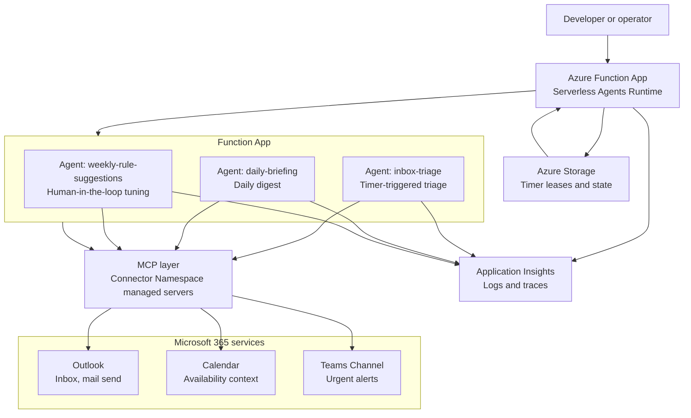

# M365 Inbox Agent for Azure Functions (Python) [](https://www.python.org/downloads/) [](https://github.com/codespaces/new?repo=Azure-Samples%2Fm365-inbox-agent-functions-python) [](https://portal.azure.com/#create/Microsoft.Template/uri/<TODO-integrator-fill>)

An opinionated inbox-triage sample for the **Azure Functions Serverless Agents Runtime (preview)**. Three timer-triggered agents read a Microsoft 365 inbox, decide what matters, send thoughtful replies, post urgent alerts to Teams, and suggest rule changes for a human to approve.

The sample also runs locally without Azure: the inbox tools fall back to `sample-data/inbox/*.json`, and outbound actions are written to `out/read-log.txt` so you can see exactly what the agents would have done.

> 📝 **Sibling sample (markdown-only):** [`Azure-Samples/m365-inbox-agent-functions-markdown`](https://github.com/Azure-Samples/m365-inbox-agent-functions-markdown) — the same agent expressed entirely in markdown (`.agent.md` + skills + MCP), with no custom Python tools. Start there if you want to learn the runtime's declarative model first; come back here to see how to extend it with code.

##  Python variant vs Markdown variant

Both repos define the **same three agents, same skills, same Bicep, same governance**. The difference is where the logic lives.

| | **This repo (Python)** | [Markdown sibling](https://github.com/Azure-Samples/m365-inbox-agent-functions-markdown) |
|---|---|---|
| Agent logic | LLM reasons from `.agent.md` + skills text, **plus** custom `tools/*.py` functions | Same, but **without** `tools/` |
| `tools/` directory | ✅ ~5 Python tools (rule matching, triage actions, etc.) | ❌ none — by design |
| I/O path | MCP **or** local file fallback when MCP env vars unset | MCP only (Outlook & Teams managed connectors) |
| Offline dev | `python chat.py` reads `sample-data/inbox/*.json`, writes `.eml`/`.md` to `out/` | Requires provisioned MCP |
| `function_app.py` | One line: `app = create_function_app()` (tools auto-discovered) | Identical one line |
| Hand-written Python | ~1 line + ~300 across `tools/` | ~1 line |

**Pick this repo if** you want a code escape hatch for offline hacking, deterministic rule matching, or learning the SDK.
**Pick the markdown sibling if** you want to see the runtime's declarative promise — production-shaped M365 agent with effectively zero hand-written code.

##  Architecture



##  How the building blocks work

| Building block | Tool that implements it | Skill that explains it | Agent that uses it |
| --- | --- | --- | --- |
| Trigger on inbox | Timer trigger declared on `inbox-triage.agent.md`; local manual runs use `POST /admin/functions/inbox-triage` | `skills/vip-rules.md` explains what counts as important inbox work | `inbox-triage` |
| Read inbox | `tools/list_inbox.py` reads Microsoft Graph through Outlook MCP when configured, or `sample-data/inbox.json` offline | `skills/vip-rules.md` describes VIP, incident, FYI, and action-required handling | `inbox-triage`, `daily-briefing`, `weekly-rule-suggestions` |
| Send email | Outlook MCP `sendMail` through the Connector Namespace; local fallback logs the draft action | `skills/vip-rules.md` explains when to draft or send a reply | `inbox-triage` |
| Post to Teams | Teams MCP channel-post tool through the Connector Namespace; local fallback logs the Teams alert | `skills/vip-rules.md` explains escalation criteria | `inbox-triage`, `daily-briefing` |

##  Prerequisites

- [uv](https://docs.astral.sh/uv/) (Python package & project manager — installs the right Python automatically)
- [Azure Functions Core Tools](https://learn.microsoft.com/en-us/azure/azure-functions/functions-run-local)
- [Azure Developer CLI (`azd`)](https://learn.microsoft.com/en-us/azure/developer/azure-developer-cli/) for Azure deployment
- Azurite or another `AzureWebJobsStorage` value for timer triggers
- For production: an Azure subscription, a Microsoft Foundry project/model deployment, and permission to authorize Microsoft 365 connectors

> **Note on `requirements.txt`:** kept in sync with `pyproject.toml` so Azure Functions Python deployment (Oryx build) works out of the box. Local development should use `uv` per the steps below.

##  Quickstart

This path proves the agent loop works **without Azure resources or connector authorization**. With MCP endpoints blank, the Python fallback tools read mock mail from `sample-data/inbox/*.json`, classify it, and write the local actions they would have taken to `out/read-log.txt`. You can see reasoning in the `func start` terminal and action records in the log. No real email is sent and no Teams post is made.

1. Install dependencies:

   ```bash
   uv sync
   ```

2. Create local settings and leave connector values blank:

   ```bash
   cp local.settings.json.example local.settings.json
   ```

3. Terminal 1: start the Functions host:

   ```bash
   uv run func start
   ```

4. Terminal 2: trigger the timer immediately instead of waiting five minutes:

   ```bash
   uv run python chat.py   # then pick 1 for inbox-triage
   ```

5. Verify the offline action log:

   ```bash
   tail -n 20 out/read-log.txt
   ```

Success looks like this:

```text
[2026-06-03T00:00:00+00:00] inbox-triage list_inbox returned 5 messages from sample-data/inbox
[2026-06-03T00:00:01+00:00] inbox-triage match_rule matched "URGENT: Customer renewal blocker needs decision today" as post_teams (VIP contact)
[2026-06-03T00:00:02+00:00] inbox-triage post_teams (offline) channel=<TEAMS_CHANNEL_ID> summary="🚨 VIP Alert: Customer renewal blocker needs decision today..."
```

Also keep the `func start` terminal visible; the run summary shows what the agent read, how it classified each message, and which tool fallback it dispatched.

##  Source Code

```text
README.md                         This guide.
chat.py                           Friendly local client for manually triggering timer agents.
.env.example                      Environment variable reference for local and deployed runs.
sample-data/inbox.json            Offline Graph-shaped inbox fixture used by local fallback tools.
sample-data/inbox/*.json          Individual mock inbox messages for scenarios and tests.
function_app.py                   Minimal Functions entry point that loads the agents runtime.
inbox-triage.agent.md             Timer agent that classifies inbox items and takes action.
daily-briefing.agent.md           Timer agent that summarizes inbox and calendar priorities.
weekly-rule-suggestions.agent.md  Timer agent that proposes rule updates for human review.
agents.config.yaml                Default model and runtime configuration.
mcp.json                          Outlook and Teams MCP server configuration.
tools/                            Local Python tools and fallback action logging.
skills/vip-rules.md               Editable triage policy used by the agents.
infra/                            Azure resources created by azd.
```

##  Deploy to Azure

1. Sign in:

   ```bash
   azd auth login
   ```

2. Set the mailbox recipient used by deployment outputs and sample actions:

   ```bash
   azd env set TO_EMAIL recipient@example.com
   ```

3. Deploy:

   ```bash
   azd up
   ```

4. After deployment, review outputs:

   ```bash
   azd env get-values
   ```

##  What Gets Deployed

- Azure Functions app on a serverless hosting plan
- Azure Storage for host state, timer leases, and runtime state
- Application Insights for traces and action logs
- Microsoft Foundry account/project connection and model deployment configuration
- Connector Namespace resources for Outlook and Teams MCP managed servers
- Managed identity and RBAC assignments needed by the Function App
- App settings for `TO_EMAIL`, MCP endpoints, Teams target IDs, and Foundry model settings

##  Authorize Connectors

Connector resources are deployed before they can access your mailbox or Teams channel. Complete this one-time step after `azd up`:

1. Open the Connector Namespace portal URL printed by deployment outputs, or build it from the deployed connector gateway name.
2. Authorize the Office 365 Outlook connection with the account whose inbox the sample should triage.
3. Authorize the Teams connection and confirm `TEAMS_TEAM_ID` and `TEAMS_CHANNEL_ID` point to the intended channel.
4. Restart or rerun the agents after authorization. Until this is complete, local fallback works, but deployed MCP calls fail with authorization errors.

Use the Connector Namespace portal URL for authorization, not just the generic Azure resource overview page.

##  Scenarios

###  1. VIP urgent mail posts to Teams

**Goal:** verify the agent recognizes VIP urgency and routes to Teams. In Python offline mode, verify the local log; with connectors authorized, verify the real Teams post.

**Setup:** the message is already in `sample-data/inbox/01-vip-urgent.json` — no action needed.

<details><summary>What's in the message</summary>

```json
{
  "subject": "URGENT: Customer renewal blocker needs decision today",
  "from": { "emailAddress": { "name": "Morgan Lee", "address": "vip-name@example.com" } },
  "body": { "content": "...blocked on the discount approval. We need a decision today..." }
}
```

</details>

**Run:**

```bash
uv run python chat.py   # then pick 1
```

**What you should see (offline / Python):**
- In the `func start` terminal: lines like `inbox-triage: classified URGENT... as vip` and `dispatching Teams alert via tool fallback`.
- In `out/read-log.txt`: `[<ts>] inbox-triage post_teams (offline) channel=<TEAMS_CHANNEL_ID> summary="🚨 VIP Alert..."`.
- Verify with: `tail -n 20 out/read-log.txt`.

**What you should see (deployed / connectors authorized):**
- A real message appears in the configured Teams channel within about one minute.
- Application Insights `traces` shows the VIP decision and Teams post.

###  2. Incident alert becomes a briefing item

**Goal:** verify the agent treats a P1 incident as urgent and includes it in the next briefing.

**Setup:** the message is already in `sample-data/inbox/03-incident-alert.json` — no action needed.

<details><summary>What's in the message</summary>

```json
{
  "subject": "P1 IcM: Checkout API elevated failures",
  "from": { "emailAddress": { "name": "Incident Bot", "address": "incident.bot@contoso.example" } },
  "body": { "content": "Severity: P1... Product: Checkout API... Impact: 18%..." }
}
```

</details>

**Run:**

```bash
uv run python chat.py   # pick 1 for triage, then pick 2 for daily-briefing
```

**What you should see (offline / Python):**
- In the `func start` terminal: incident classification plus a briefing summary that names Checkout API.
- In `out/read-log.txt`: `post_teams (offline)` for the incident and `send_reply (offline)` for the daily briefing.
- Verify with: `tail -n 20 out/read-log.txt` and open the newest `out/*.eml`.

**What you should see (deployed / connectors authorized):**
- A Teams alert appears for the P1 incident.
- The configured `TO_EMAIL` mailbox receives a daily briefing that includes severity, product, impact, and owner ask.

###  3. Action-required mail gets a thoughtful reply

**Goal:** verify the agent recognizes a response deadline and prepares a grounded reply.

**Setup:** the message is already in `sample-data/inbox/05-action-required.json` — no action needed.

<details><summary>What's in the message</summary>

```json
{
  "subject": "Action required: Review launch FAQ by Friday",
  "from": { "emailAddress": { "name": "Priya Patel", "address": "priya.patel@contoso.example" } },
  "body": { "content": "Could you review the launch FAQ by Friday..." }
}
```

</details>

**Run:**

```bash
uv run python chat.py   # then pick 1
```

**What you should see (offline / Python):**
- In the `func start` terminal: `action-required` classification and reply planning.
- In `out/read-log.txt`: `[<ts>] inbox-triage send_reply (offline) to=priya.patel@contoso.example subject="..."`.
- Verify with: `tail -n 20 out/read-log.txt` and open the newest matching `out/*.eml`.

**What you should see (deployed / connectors authorized):**
- Outlook sends or drafts a concise reply that acknowledges Friday and lists next steps.
- Application Insights `traces` shows the reply decision.

##  Customizing Rules

Edit `skills/vip-rules.md` to change who counts as a VIP, what should be skipped, and which topics require Teams escalation. Redeploy after changing production rules:

```bash
azd deploy
```

The `weekly-rule-suggestions` agent reviews recent decisions and suggests small policy changes. Treat those suggestions as human-in-the-loop recommendations: copy only the changes you approve into `skills/vip-rules.md`, review them, then redeploy.

##  Using Microsoft Foundry (BYOK)

For Bring Your Own Key / Bring Your Own Model scenarios, configure these values locally or let `azd up` wire them from Bicep outputs:

```bash
MODEL_DEPLOYMENT_NAME=gpt-5-mini
AZURE_AI_PROJECT_ENDPOINT=https://<your-ai-services>.services.ai.azure.com/api/projects/<project>
```

The agents use `MODEL_DEPLOYMENT_NAME` to select the deployed model and `AZURE_AI_PROJECT_ENDPOINT` to reach your Foundry project. Keep connector endpoint values blank for offline sample-data runs; set them for deployed Microsoft 365 actions.

##  Cleanup

Delete Azure resources when you are finished:

```bash
azd down --purge
```

##  Troubleshooting

| Symptom | Try this |
| --- | --- |
| Connector authorization fails | Reopen the Connector Namespace portal URL from deployment outputs, sign in with the mailbox/channel owner, and reauthorize Outlook and Teams. |
| MCP endpoint missing | Run `azd env get-values` and confirm `OUTLOOK_MCP_ENDPOINT` and `TEAMS_MCP_ENDPOINT` are populated. If blank, rerun `azd up` and check Connector Namespace deployment logs. |
| Timer is not firing | Confirm `AzureWebJobsStorage` is valid, Azurite is running for local development, and the Functions host shows the timer trigger loaded. See the Azure Functions timer trigger docs. |
| Local run cannot reach Azure | Leave MCP endpoint variables blank and use option 1 in `chat.py`; the tools should read `sample-data/inbox.json` and log actions to `out/read-log.txt`. |
| Manual trigger returns 404 | Confirm the Functions host is running and agent function names are `inbox-triage`, `daily-briefing`, and `weekly-rule-suggestions`. |

##  Learn More

- [Serverless agents runtime in Azure Functions](https://learn.microsoft.com/en-us/azure/azure-functions/functions-serverless-agents-runtime)
- [Tutorial: Host an MCP server on Azure Functions](https://learn.microsoft.com/en-us/azure/azure-functions/functions-mcp-tutorial)
- [Model Context Protocol specification](https://modelcontextprotocol.io/specification/latest)
- [Office 365 Outlook connector reference](https://learn.microsoft.com/en-us/connectors/office365/)
- [Microsoft Teams connector reference](https://learn.microsoft.com/en-us/connectors/teams/)
- [Azure Functions timer trigger](https://learn.microsoft.com/en-us/azure/azure-functions/functions-bindings-timer)
