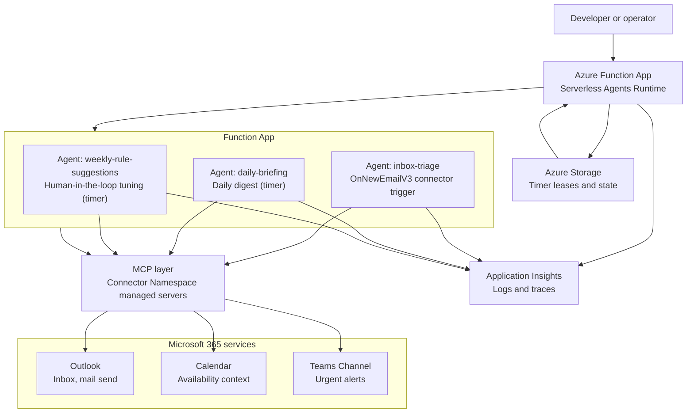

# How it works

← Back to the [README](../README.md)

The app is an Azure Functions app running the serverless agents runtime. Agents are markdown files that reason over your rules; Microsoft 365 actions flow through Entra-authorized MCP connectors.

## Architecture



## How the building blocks work

| Building block | Tool that implements it | Skill that explains it | Agent that uses it |
| --- | --- | --- | --- |
| Trigger on inbox | `connector_trigger` on `inbox-triage.agent.md` (event-driven on new mail); local runs call the agent's `/chat` endpoint via `chat.py` | `skills/vip-rules.md` explains what counts as important inbox work | `inbox-triage` |
| Read inbox | Outlook MCP `office365_GetEmailsV3` through the Connector Namespace in LIVE; in DRY RUN `chat.py` injects `sample-data/inbox/*.json` as the snapshot | `skills/vip-rules.md` describes VIP, incident, FYI, and action-required handling | `inbox-triage`, `daily-briefing`, `weekly-rule-suggestions` |
| Send email | Outlook MCP `office365_SendEmailV2` through the Connector Namespace; in DRY RUN the reply is drafted as text in the report | `skills/vip-rules.md` explains when to reply | `inbox-triage`, `daily-briefing`, `weekly-rule-suggestions` |
| Post to Teams | Teams MCP `teams_PostMessageToConversation` through the Connector Namespace; in DRY RUN the alert is drafted as text | `skills/vip-rules.md` explains escalation criteria | `inbox-triage`, `daily-briefing` |

## Three modes, one client

`chat.py` detects which mode you are in and labels every run:

- **🟡 Offline** — no connectors configured. All agents DRY RUN from the sample inbox and render text deliverables. Nothing is sent.
- **🟡 Partial** — Outlook is wired but `MAILBOX_OWNER_EMAIL` (or the Teams ids) is still a placeholder. Agents still DRY RUN for safety, so a placeholder recipient never bounces. You are one setting from live; option 4 shows the exact step.
- **🟢 Live** — every required connector is real. Agents read your real inbox and send real mail / Teams posts.

The agent prompts stay simple: they default to LIVE, and the client injects a `RUN MODE: DRY RUN` block (plus a simulated inbox snapshot for the timer agents) when any required connector is a placeholder.

## Chat with your inbox (read-only)

Option 5 in `chat.py` opens a short back-and-forth where you ask questions about
your recent mail ("what's urgent?", "who emailed about the deploy?", "summarize
the thread from finance"). It is **read-only by design**:

- The `inbox-chat` agent is declared with `mcp: false`, so it has **no tools**.
  It cannot send, reply, post to Teams, or call any connector. This is enforced
  by configuration, not by the model's judgement — read-only is deterministic.
- The read itself happens in the client: `chat.py` fetches your recent inbox
  using only the Outlook read operation (`office365_GetEmailsV3`), fail-closing
  if anything else is exposed, and injects it as a versioned `INBOX SNAPSHOT`.
  In Offline/DRY it injects `sample-data/inbox/*.json` instead. Type `refresh`
  to re-read, `q` to quit.
- Because the read is client-side, only `chat.py` provides inbox context; a raw
  POST to `/agents/inbox_chat/chat` with no snapshot gets a "no inbox context"
  answer rather than a guess.
- To let this agent take actions later, flip `mcp: false` → `mcp: true` in
  `inbox-chat.agent.md`. That exposes **all** configured MCP tools (Outlook and
  Teams) to the agent — a deliberate config change, not a runtime/LLM decision.

## Choosing a model provider

The agents runtime auto-selects a provider from environment variables. This sample defaults to Microsoft Foundry with managed identity. `azd provision` creates the AI Services account + model deployment, and `infra/scripts/hydrate-local-settings.sh` copies the outputs into `local.settings.json`. No API keys.

**Local + production (default), Foundry + Entra ID:**

```bash
AZURE_FUNCTIONS_AGENTS_PROVIDER=foundry
FOUNDRY_PROJECT_ENDPOINT=https://<your-ai-services>.services.ai.azure.com/api/projects/<project>
FOUNDRY_MODEL=gpt-5.4-mini
```

Local auth flows through `DefaultAzureCredential` (your `az login`); deployed auth uses the function app's user-assigned managed identity (`AZURE_CLIENT_ID`).

**Azure OpenAI direct (alternative):** set `AZURE_OPENAI_ENDPOINT` and `AZURE_OPENAI_DEPLOYMENT`. Auth defaults to managed identity; set `AZURE_OPENAI_API_KEY` if you must use keys.

> **Note on GitHub Models for free local dev:** the runtime calls the OpenAI Responses API (`/responses`), which GitHub Models does not implement (`/chat/completions` only). Tracking with the runtime team.

Keep M365 connector endpoint values blank for offline sample-data runs; set them for deployed Microsoft 365 actions.

## Python vs Markdown

This repo uses Python tools alongside `.agent.md` markdown — the LLM reasons from the markdown skills, and one `tools/match_rule.py` classifier provides deterministic rule matching. A pure-markdown variant (no `tools/` directory) was prototyped at `Azure-Samples/m365-inbox-agent-functions-markdown` but is **archived** — both variants worked, and this Python version is the maintained one.
